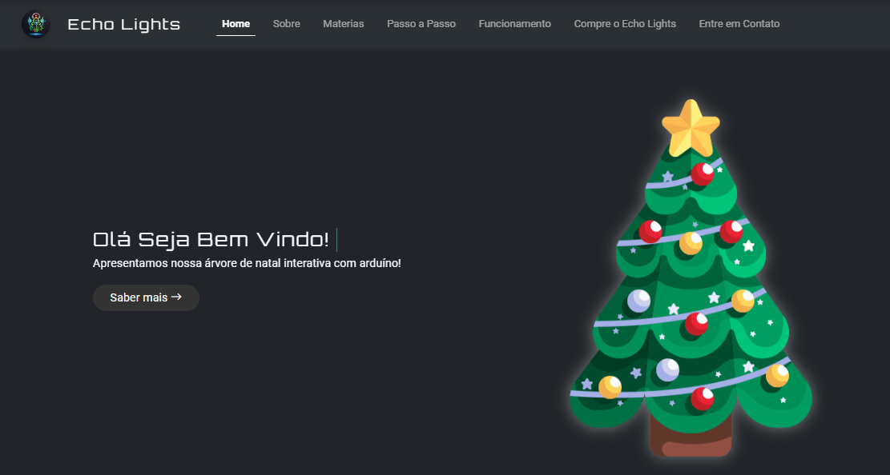

# Echo Lights - Landing Page

## Sobre 👋
Desenvolvido sobre um projeto de robótica na escola, Echo Lights é o nome do produto final. O site do projeto apresenta suas funcionalidades, o processo de criação e as tecnologias utilizadas, mostrando o aprendizado em robótica e programação. 

## Tecnologias 🚀

## O que o site oferece? ✔️
<ul>
  <li>Apresentação clara e direta do conteúdo;</li>
  <li>UI/UX Design para melhor experiência do usuário;</li>
  <li>Layout moderno e responsivo com Bootstrap;</li>
  <li>Validação de formulários e integração com banco de dados;</li>
  <li>Animações em tempo real usando a biblioteca AOS.</li>
</ul>

## Acesse aqui🔥
https://jaojogadez.github.io/landing-page-echo-lights/

## Entre em contato ou envie um feedback 💬

